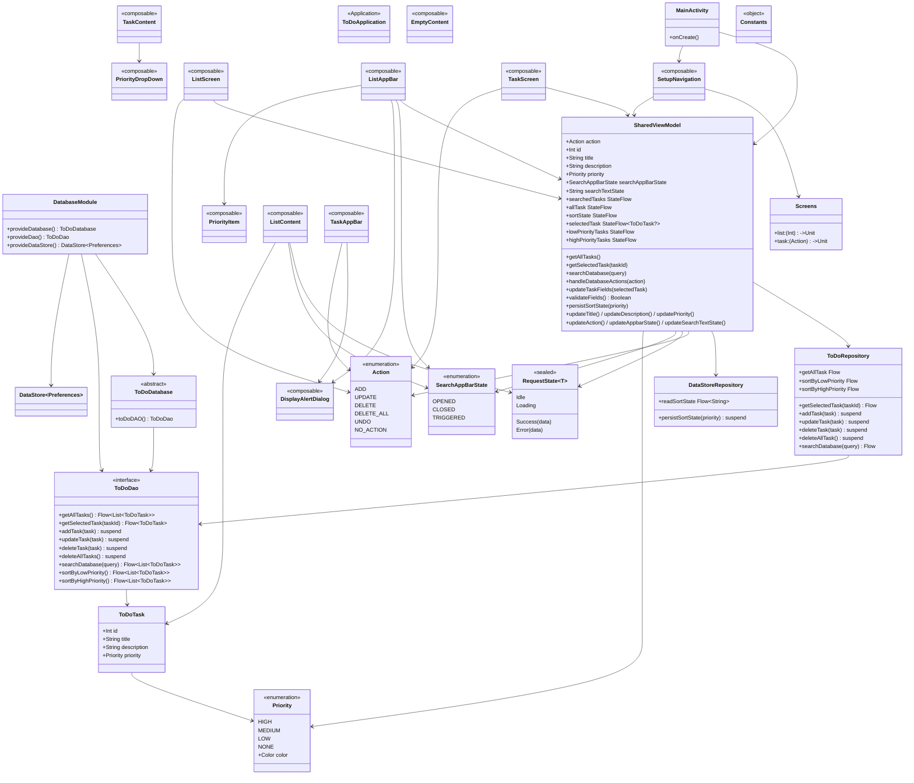
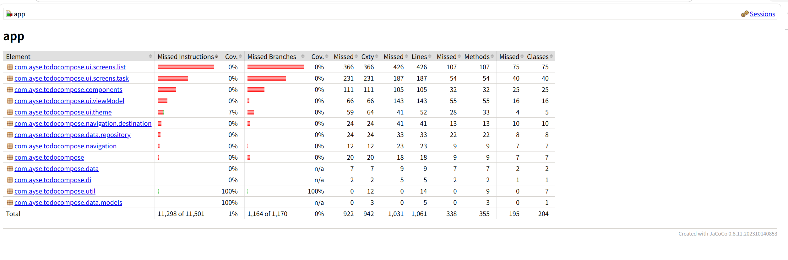
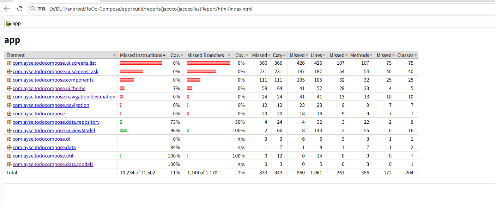
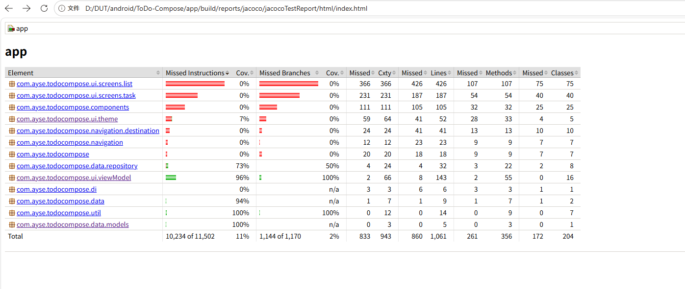
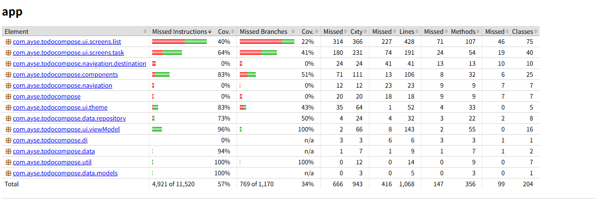
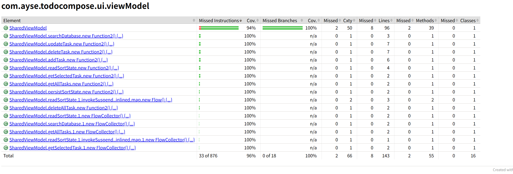
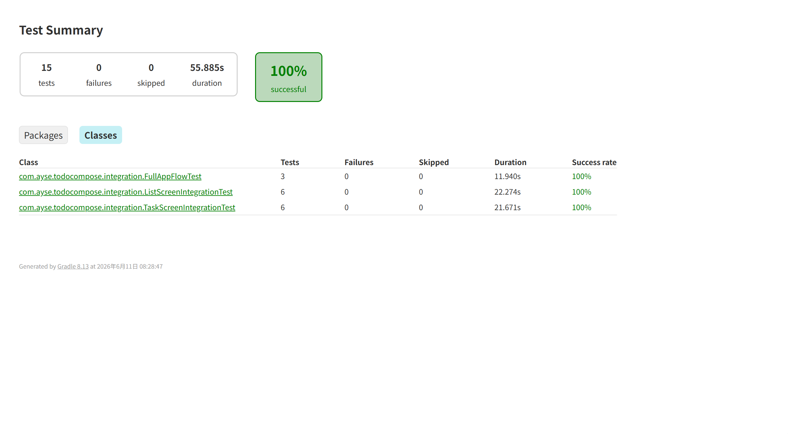

# ToDo-Compose 应用的软件测试与性能评估报告

## 应用概况

**ToDo-Compose** 是一个基于 Jetpack Compose 的待办事项 Android 应用。它让用户可以创建、查看、搜索、排序、编辑和删除带优先级（高/中/低）的任务，支持滑动手势删除 + 撤销，以及深色/浅色主题切换。

**技术栈：** Kotlin + Jetpack Compose + Room + DataStore + Hilt + Navigation Compose


### 模块划分 

| 模块                | 核心文件                                                                                   | 职责                                         |
| ------------------- | ------------------------------------------------------------------------------------------ | -------------------------------------------- |
| **data**            | `ToDoTask`, `ToDoDao`, `ToDoDatabase`, `Priority`, `ToDoRepository`, `DataStoreRepository` | 数据层 — Room DB + DataStore 持久化          |
| **di**              | `DatabaseModule`                                                                           | Hilt 依赖注入                                |
| **ui/viewModel**    | `SharedViewModel`                                                                          | 唯一 ViewModel，管理全部 UI 状态与数据库操作 |
| **ui/screens/list** | `ListScreen`, `ListContent`, `ListAppBar`, `EmptyContent`                                  | 主列表界面                                   |
| **ui/screens/task** | `TaskScreen`, `TaskContent`, `TaskAppBar`                                                  | 添加/编辑任务界面                            |
| **components**      | `PriorityDropDown`, `PriorityItem`, `DisplayAlertDialog`                                   | 可复用 Compose 组件                          |
| **navigation**      | `Navigation`, `Screens`, `ListComposable`, `TaskComposable`                                | 导航路由与参数传递                           |
| **util**            | `Action`, `RequestState`, `SearchAppBarState`, `Constants`                                 | 枚举与常量                                   |
| **ui/theme**        | `Color`, `Theme`, `Type`, `Shape`, `Dimensions`                                            | Material 主题定制                            |


### 核心逻辑流

```
MainActivity
  └─ SetupNavigation (NavHost)
       ├─ ListScreen ←── startDestination (list/{action})
       │    ├─ 观察 SharedViewModel.allTask / searchedTasks / sortState
       │    ├─ FAB(+)  → navigate 到 TaskScreen(taskId=-1)
       │    ├─ 点击任务 → navigate 到 TaskScreen(taskId=N)
       │    ├─ Swipe 删除 → Action.DELETE → Snackbar(UNDO)
       │    ├─ 搜索 → SharedViewModel.searchDatabase()
       │    └─ 排序 → DataStore 持久化 → 切换 Flow
       │
       └─ TaskScreen (task/{taskId})
            ├─ taskId=-1 → 新建模式 (NewTaskAppBar)
            ├─ taskId=N  → 编辑模式 (ExistingTaskAppBar)
            ├─ 返回 → Action.ADD / UPDATE / DELETE / NO_ACTION
            └─ SharedViewModel.handleDatabaseActions() 调度
```

### 工程量评估

- **工程规模：** 小 (~30 个源文件, 不含测试)
- **复杂度：** 低~中
- **架构模式：** MVVM + Repository + DI
- **数据库：** 1 张表 (ToDoTask)，5 个 DAO 查询
- **导航：** 2 个目的地，1 个共享 ViewModel
- **亮点：** Compose 动画 (SwipeToDismiss, AnimatedVisibility, 旋转箭头), 协程 Flow, DataStore 偏好存储, Hilt 注入


### 类图 (Mermaid)




这是一个**典型的 Android MVVM + Compose 小项目**，结构清晰。核心是 **1 个 ViewModel + 1 张 Room 表 + 2 个页面**，使用 Flow 驱动的响应式数据流，Hilt 管理依赖注入，DataStore 记录排序偏好。总体上代码组织规范，约 30 个生产源文件，复杂度低到中等。


从类图中可以看出来，最重要的类是SharedViewModel。

### 重点类SharedViewModel 

SharedViewModel (app/src/main/.../ui/viewModel/SharedViewModel.kt:29) 是整个应用的中枢神经系统：

* 是唯一一个 ViewModel，所有 UI 组件全部依赖它
* 持有 8 个可观察状态（action, id, title, description, priority, searchAppBarState, searchTextState, selectedTask）
* 管理 3 个 StateFlow（allTask, searchedTasks, sortState）
* 桥接 2 个 Repository（ToDoRepository + DataStoreRepository）
* 承担所有 CRUD 调度、搜索、排序、字段校验、导航动作


## 单元测试


### 基于junit和MockK和Robolectric的测试以及对于ui.screens.list的测试

本项目在测试过程中，逐步引入了 JUnit、MockK 与 Robolectric 三种测试方案，并结合 JaCoCo 对测试覆盖率进行了持续统计与分析。最初阶段主要使用 JUnit 对枚举类与工具类进行基础单元测试，包括 `Priority`、`Action`、`RequestState` 与 `SearchAppBarState` 等核心状态类，共完成 37 个测试用例，全部通过。这一阶段被测试文件的行覆盖率均达到 100%，但由于项目主体仍以 Compose UI、Room 数据库与 ViewModel 为主，因此项目整体覆盖率仅约为 1%。

随后，在原有基础上进一步引入 MockK，对 Repository 与 ViewModel 层进行了模拟测试。新增了 `ToDoRepositoryTest`、`DataStoreRepositoryTest` 与 `SharedViewModelTest` 等测试类，通过 mock 数据源、协程与 Flow 返回值，实现了对业务逻辑层的完整验证。此阶段测试总数扩展至 84 项，全部通过。多个核心类覆盖率显著提升，其中 `ToDoRepository.kt` 达到 100%，`SharedViewModel.kt` 达到 94.2%，项目整体测试覆盖率提升至约 11%。

之后继续引入 Robolectric，对 Android 环境相关代码进行本地单元测试，包括 Room 数据库、Compose 组件与 UI 页面等内容。测试过程中对 Gradle 配置、Manifest、Compose Rule 与 Room 插入逻辑进行了修复，使全部 114 个测试最终通过。此阶段新增了 `ToDoDaoTest`、Compose 组件测试以及 `ui.screens.list.EmptyContentTest` 等 UI 测试，进一步覆盖了此前无法通过普通 JVM 单元测试触达的 Android 代码区域。

| 阶段     | 测试技术      | 测试数量 | 主要覆盖内容              | 项目整体覆盖率     |
| -------- | ------------- | -------- | ------------------------- | ------------------ |
| 第一阶段 | JUnit         | 37       | util / model 枚举与状态类 | 约 1%              |
| 第二阶段 | JUnit + MockK | 84       | Repository 与 ViewModel   | 约 11%             |
| 第三阶段 | Robolectric   | 114      | Compose UI 与 Room        | 覆盖范围进一步扩大 |


最后，通过 JaCoCo 分析发现 `ui.screens.list` 包占据项目代码比例最大，同时覆盖率最低，因此后续重点针对该模块补充了大量 Compose 页面测试与交互测试。经过进一步扩展测试用例后，`ui.screens.list` 覆盖率提升至约 40%，项目整体测试覆盖率最终提升至 57%。整体来看，项目测试经历了从基础逻辑测试、业务逻辑 Mock 测试，到 Android UI 与 Compose 测试的逐步递进过程，最终构建出较为完整的 Android 应用测试体系。














### 针对SharedViewModel重点类的单元测试SharedViewModelTest.kt

**app/src/test/java/com/ayse/todocompose/ui/viewModel/SharedViewModelTest.kt**

针对 SharedViewModel 编写的单元测试，主要使用了 JUnit、MockK 和 kotlinx.coroutines.test 等工具，对 ViewModel 的状态管理和业务逻辑进行验证。测试中通过 mock 模拟了 ToDoRepository 和 DataStoreRepository，避免真正访问数据库，从而只关注 ViewModel 本身的逻辑是否正确。

测试内容主要包括三类：一是初始化状态测试，例如检查默认的 action、priority、搜索栏状态等是否正确；二是输入与状态更新测试，例如 updateTitle()、updateDescription()、validateFields() 等函数是否能够正确修改和校验数据；三是数据库行为测试，例如调用 handleDatabaseActions(Action.ADD) 后，是否真正触发了 addTask()，以及搜索、读取任务等功能是否能正确更新状态。

整体测试流程是：先构造 mock 数据和测试环境，然后调用 ViewModel 的方法，再通过 assertEquals、assertTrue、coVerify 等断言验证状态变化或 Repository 调用是否符合预期。




如图，针对SharedViewModel这一重点类进行了充分的测试，jacoco测试覆盖率达96%


## 集成测试

### 集成测试总体设计

在完成单元测试与 Robolectric 测试后，项目进一步实现了基于 Android Instrumentation 的集成测试，并在 `app/src/androidTest/java/com/ayse/todocompose/integration/` 下新增了 3 个集成测试文件，共计 15 个测试用例，最终全部通过。测试主要覆盖了列表页面、任务编辑页面以及完整的应用操作流程，重点验证了 Compose UI、ViewModel 与 Room 数据库之间的数据联动是否正确。

本次集成测试采用“真实组件集成”方案，而非简单的 Composable Mock 测试。每个测试都会创建独立的内存 Room 数据库与 DataStore 文件，通过手动依赖注入构建 `SharedViewModel`，从而保证测试过程与真实应用运行逻辑一致。同时，测试中使用 `waitUntil()` 与 `waitForIdle()` 等方法处理 Compose 重组与 Room Flow 的异步刷新问题，并在 `@After` 中统一关闭数据库与清理临时文件，实现测试间完全隔离。

| 测试文件                     | 测试数量 | 主要验证内容                     |
| ---------------------------- | -------- | -------------------------------- |
| ListScreenIntegrationTest.kt | 6        | 列表渲染、空状态、搜索、导航回调 |
| TaskScreenIntegrationTest.kt | 6        | 输入同步、优先级选择、Add 操作   |
| FullAppFlowTest.kt           | 3        | 添加、删除、完整任务生命周期     |

### 页面级集成测试

`ListScreenIntegrationTest` 主要针对任务列表页进行了端到端验证。测试内容包括：空数据库情况下空状态 UI 是否显示、数据库中的任务是否能够自动渲染到页面、FAB 按钮点击后是否正确触发导航回调，以及搜索功能是否能够通过 Room 查询实时过滤任务列表。其中，“搜索过滤”测试完整验证了从搜索框输入、IME 搜索动作触发、ViewModel 调用 `searchDatabase()`、Room 查询、Flow 重发射，到最终 Compose UI 更新的整个数据链路。

`TaskScreenIntegrationTest` 则重点测试任务编辑页面与 ViewModel 的联动逻辑。测试覆盖了新增任务页面的默认状态、已有任务数据回显、标题与描述输入框对 ViewModel 状态的同步更新、优先级下拉菜单选择，以及点击 Add 按钮后是否正确触发 `Action.ADD`。这些测试验证了 Compose 输入组件与状态管理层之间的数据双向绑定机制，确保用户操作能够正确反映到业务状态中。

### 完整业务流程测试

在页面级测试基础上，项目还实现了 `FullAppFlowTest`，用于验证完整的应用业务流程。测试包括“添加任务后列表实时显示”、“删除任务后列表自动移除”以及“添加→显示→删除→消失”的完整任务生命周期轮转。该部分测试通过真实的 ViewModel、Repository 与 Room 数据库联动，验证了 Room 的 `InvalidationTracker`、Flow 数据流重发射以及 Compose UI 自动重组是否能够正确协同工作。

其中，`addThenDeleteTask_fullRoundTrip` 是覆盖最完整的端到端测试：测试从空页面开始，通过 ViewModel 添加任务，再等待 Room 数据库更新驱动 UI 重组，随后继续执行删除操作，并最终验证页面中的任务彻底消失。该测试验证了应用在同一生命周期内连续执行数据库增删操作时，数据流、状态流与 UI 层之间能够保持一致性与实时同步，说明整个 ToDo 应用的核心功能链路已经具备较高的稳定性与可靠性。


### 测试结果

如下图所示，15个测试均通过了。




## 性能测试

### 性能测试整体设计

在完成单元测试、集成测试与 UI 测试后，项目进一步开展了基于 Appium 与 Pytest 的 Android 应用性能测试。性能测试主要围绕应用启动速度、任务操作响应时间、页面滚动流畅度以及内存稳定性等方面展开，共编写 13 个性能测试用例，最终全部通过。测试过程中结合 adb 性能采集工具，对启动耗时、内存 PSS、CPU 占用以及帧渲染情况进行了实时统计，并自动生成 CSV 与 HTML 格式性能报告。

整个性能测试框架位于 `appium_tests/` 目录下，采用 Python + Pytest + Appium 的方案实现。其中 `performance_collector.py` 负责通过 adb 收集 Android 性能指标，`reporter.py` 与 `gen_perf_report.py` 用于生成完整性能报告。测试运行方式为：

```bash
python -m pytest tests/ -v --html=report/latest_report.html --self-contained-html
```

| 测试类别      | 主要内容                       |
| ------------- | ------------------------------ |
| 启动性能测试  | 冷启动、热启动、启动内存与 CPU |
| CRUD 性能测试 | 添加、编辑、删除任务响应时间   |
| 页面性能测试  | 搜索、排序、滚动流畅度         |
| 稳定性测试    | 内存泄漏、空闲内存稳定性       |

### 核心性能测试内容

本次性能测试重点验证了应用在真实运行环境下的响应效率与资源占用情况。在启动性能方面，测试分别统计了应用冷启动与热启动耗时，其中冷启动时间约为 1308ms，热启动时间约为 96ms，说明应用在重新进入前台时具备较快的恢复速度。同时，启动阶段空闲内存 PSS 约为 73MB，CPU 占用保持较低水平，整体资源消耗较为稳定。

在业务操作性能方面，测试覆盖了任务的新增、编辑、删除、搜索与排序等核心功能。例如，新增任务测试验证了任务添加操作能够在 5000ms 内完成，删除操作能够在 4000ms 内完成，搜索与排序操作也均在预期时间范围内响应。测试过程中不仅验证了 UI 操作本身，还同时监控 Room 数据库更新、Compose 页面重组以及列表刷新带来的性能开销。

### 滚动与内存稳定性测试

除功能响应速度外，本次测试还重点关注了 Compose 列表滚动与长期运行时的内存稳定性。在滚动测试中，通过持续滚动任务列表并采集帧渲染数据，对页面是否出现卡顿（Jank）进行了检测。测试结果显示应用整体帧渲染正常，仅在冷启动阶段存在少量 Jank 帧，滚动过程中未出现明显掉帧或界面卡顿问题。

此外，项目还进行了多轮内存稳定性测试，包括连续批量添加任务、连续页面导航以及应用空闲状态下的内存监测。其中，“10 次导航无内存泄漏”测试验证了页面切换过程中不存在明显对象泄漏；“滚动内存增长 < 50MB”与“空闲内存稳定”测试则表明应用在长时间运行后仍能够保持较稳定的内存占用。最终，13 项性能测试全部通过，说明该 ToDo-Compose 应用在启动性能、交互响应与资源管理方面均达到了较好的运行效果。

### 整体性能指标


| 指标                | 值    |
| ------------------- | ----- |
| Cold Start (ms)     | 1308  |
| Warm Start (ms)     | 96    |
| Memory PSS (KB)     | 74772 |
| CPU (%)             | 0     |
| Frames Rendered     | 6     |
| Janky Frames        | 3     |
| P50 Frame Time (ms) | 48    |
| P90 Frame Time (ms) | 950   |


## 总结

总体来看，本项目围绕 ToDo-Compose 应用构建了一套较为完整的 Android 测试体系，覆盖了单元测试、UI 测试、集成测试以及性能测试等多个层面。在测试过程中，逐步引入了 JUnit、MockK、Robolectric、Compose Instrumentation、Appium 与 Pytest 等技术，对应用的状态管理、数据库操作、页面交互、完整业务流程以及运行性能进行了系统性验证。尤其是针对核心类 `SharedViewModel`、`ui.screens.list` 等关键模块进行了重点测试，使项目整体测试覆盖率最终提升至 57%，核心 ViewModel 覆盖率达到 96%。

在此基础上，项目还进一步完成了真实 Android 环境下的集成与性能测试，验证了 Room、Flow、Compose 与 ViewModel 之间的数据联动能力，以及应用在长时间运行、频繁导航与列表滚动情况下的稳定性与资源占用情况。最终，全部集成测试与性能测试均顺利通过，说明该应用已经具备较好的功能正确性、稳定性与运行性能，也体现了 Jetpack Compose + MVVM 架构在中小型 Android 应用中的良好工程实践效果。
